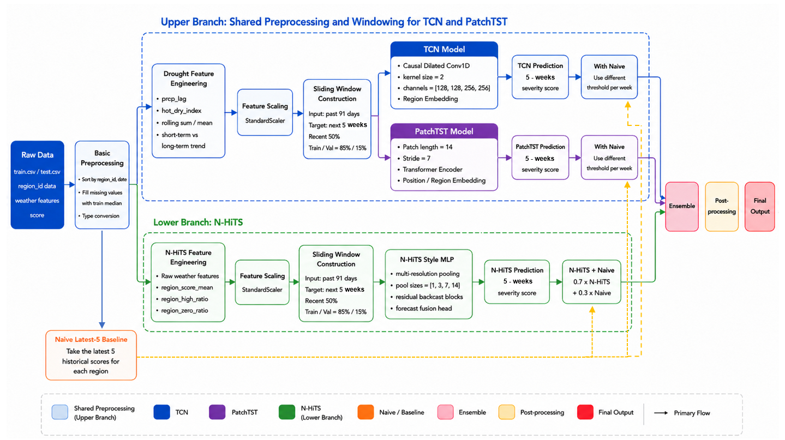
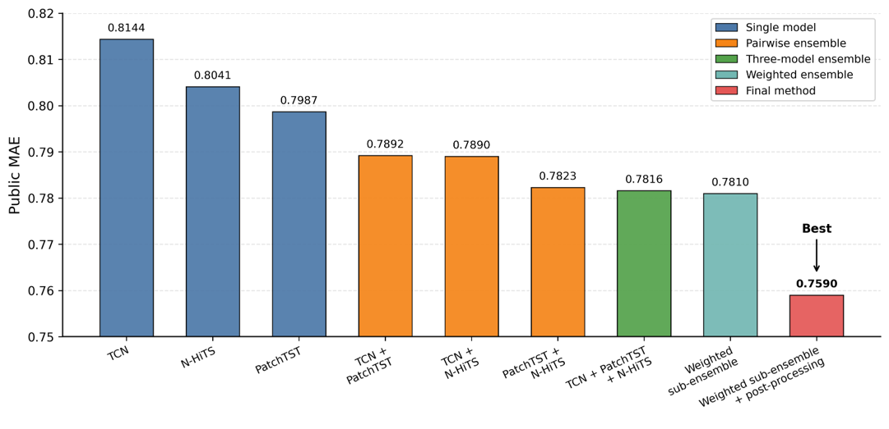

## DM2026-Final-Project: Natural Disaster Severity Prediction

* **Name and Student ID:** 314551087 黃奕睿, 314554023 李思恩, 314554021 王品喻
* **Team 4** 
## Abstract

This project aims to predict future drought severity scores for different geographic regions using historical meteorological data. We formulate the task as a multi-step time-series forecasting problem, where the past 91 days of daily weather observations are used to predict the severity scores for the next five prediction weeks. To improve prediction performance, we propose a multi-branch forecasting pipeline that combines different feature representations. One branch focuses on drought-related meteorological features, such as rolling precipitation statistics, hot-dry indices, and short-term versus long-term weather trends, while another branch incorporates region-level historical score priors to capture long-term regional characteristics. The proposed method further combines multiple forecasting models with a Naive historical reference and ensemble learning to improve prediction stability. Empirical post-processing is also applied to adjust the prediction distribution, clip outputs to the valid score range, and reduce unstable low-score predictions. Experimental results on the public leaderboard show that our method achieves a Public MAE of 0.7590 and ranks 2nd, demonstrating the effectiveness of combining diverse feature engineering strategies, ensemble learning, and post-processing for drought severity prediction.

## Overall Pipeline of Our Method




## Environment Setup
### Dependencies

```bash
pip install -r requirements.txt
```

### Directory Structure

```
.
├── Tcn.py               # Tcn model
├── PatchTST.py          # PatchTST model
├── NHits.py             # NHits model
├── per_week_weight.py   # change weight for PatchTST and Tcn
├── ensemble2sub.py      # ensemble 2 csv
├── postprocessing.py    # postprocessing
├── requirements.txt     # Project dependencies
└── data/                # Dataset directory
```

## Usage

### Step1: Training 3 model

Tcn
```bash
python Tcn.py 
```
PatchTST
```bash
python PatchTST.py 
```
NHits
```bash
python NHits.py 
```
### Step2: Change weight for PatchTST and Tcn

check the root, you will get 2 .npy after training  PatchTST and Tcn
* model_preds_drought_features.npy
* naive_preds_drought_features.npy
```bash
SAMPLE_SUBMISSION = "./data/sample_submission.csv"
model_preds = np.load("model_preds_drought_features.npy")
naive_preds = np.load("naive_preds_drought_features.npy")

#need to do for  
```

```bash
per_week_weight.py
```

### Inference

```bash
python infer_V4.py
```
## Strategy and Adjustments

The following modifications and strategies are applied in the model and training process:

1. Uses residual learning to predict only the degradation correction.
2. Uses Charbonnier Loss for stable image restoration training.
3. Uses	DetailRefineBlock.
4. Uses	FrequencyEnhanceBlock.
5. Uses	Gated skip fusion.

## Additional experiments

### V1~3 (select the version you want)
```bash
python train_V<1~3>.py # select the version you want

python infer_V<1~3>.py
```

## Performance

| # | Method | Public MAE |
|---|---|---:|
| 1 | TCN | 0.8144 |
| 2 | N-HiTS | 0.8041 |
| 3 | PatchTST | 0.7987 |
| 4 | TCN + PatchTST | 0.7892 |
| 5 | TCN + N-HiTS | 0.7890 |
| 6 | PatchTST + N-HiTS | 0.7823 |
| 7 | TCN + PatchTST + N-HiTS | 0.7816 |
| 8 | Weighted sub-ensemble | 0.7810 |
| 9 | Weighted sub-ensemble + post-processing | 0.7590 |



## Performance snapshot

